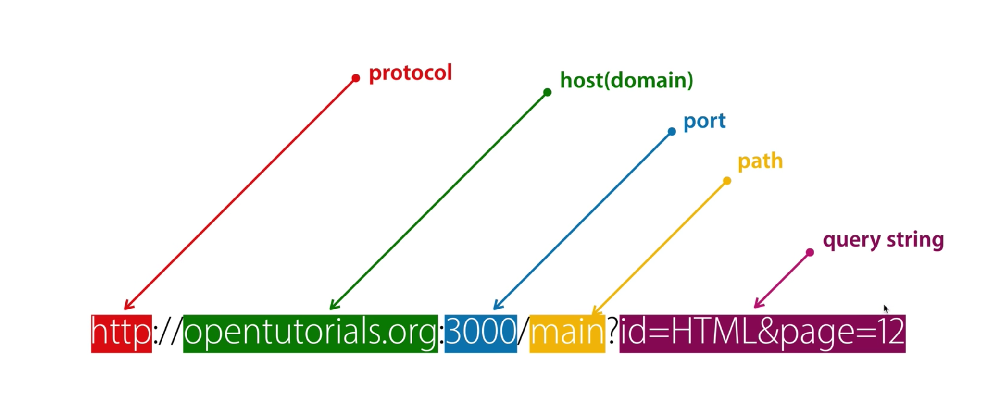

# Node Express js


## Url 기본




### express 기본세팅

```bash
npm install express-generator -g #express-generator를 글로벌하게 설치 
express --view=jade backend #backend라는 폴더생성
cd backend
npm install #필요한 모듈 설치
DEBUG=backend:* npm start #서버 시작
```


### 라우터설정(routes/movie.js)

#### - Django에서의 URL + VIEW가 합쳐진 것과 유사

```js
const express = require('express');
const router = express.Router();
const movies = require('../data/movie.json');

router.get('/', function(req, res){
   // "/movies/"로   get요청이 오면 모든 데이터 반환하는거임
    res.send(movies);
});

router.get('/:id', function(req, res){
  // "/movies/:id"로 get 요청이 오면
    const id = parseInt(req.params.id, 10);
    const movie = movies.filter(function(movie){
        return movie.id === id;
    });
    res.send(movie);
});

module.exports = router;

```


### app.js 수정

```js
// require를 통해 가져옴
const movieRouter = require('./routes/movie');


// router => Django에서 프로젝트폴더의 urls.py에서  include로 잡는것과 동일
app.use('/', indexRouter);
app.use('/users', usersRouter);
app.use('/movies/', movieRouter);

```


### 이제 FE로

#### - config/index.js에서 proxyTable이라는 객체를 찾는다

```js
proxyTable: {
    '/movies': {
        target: 'http://localhost:3000/movies',
        changeOrigin: true,
        pathRewrite: {
            '^/movies': ''
        }
    }
},

```

- 이 코드는, Vue에서 "...:8080/movies"으로 요청이 오면, "...:3000/movies"를 프록시로 사용하는 코드


## Vuejs + Express + MySQL로 NodeAPI 서버구성하기

- 프로젝트 생성 후 

  #### vue.config.js

```js
module.exports = { 
    devServer: { //① api 요청이 있을때 어디에서 처리할지를 설정
      proxy: { 
        '/api': { 
          target: 'http://localhost:3000/api',
          changeOrigin: true, 
          pathRewrite: { 
            '^/api': ''
          } 
        } 
      } 
    },
    outputDir: '../backend/public',  //② 배포 파일의 위치를 지정
  }
```


### routes/movies.js

```js
var express = require('express');
var router = express.Router();
var movies = require('../movies.json');

## req는 프론트쪽에서 넘어오는 것
## res 프론트쪽으로 보내주는 것 같음
router.get('/', function (req, res, next) {
    res.send(movies)
   });

router.get('/:id', function (req, res, next) {
    var id = parseInt(req.params.id, 10)
    
    ## parseInt는 string을 , n진수로 만들어줌
    var movie = movies.filter(function (movie) {
    return movie.id === id
    });
    res.send(movie)
   });

module.exports = router;
```


### src/main.js 

```js
import Vue from 'vue'
import App from './App.vue'
import {router}  from './routes/index.js'
import axios from 'axios'
# 여기다가 import 될 듯

Vue.config.productionTip = false
Vue.prototype.$http = axios;
# 여기다가 import 될 듯
new Vue({
  render: h => h(App),
  router,
}).$mount('#app')
```


### mariadb연동 - 시퀄라이즈(Sequelize) 사용

1. Express 프로젝트 폴더 경로에서 sequelize 및 mariadb 패키지 설치: `npm i sequelize mariadb`
2. sequelize 커맨드 사용을 위한 sequelize 전역 설치:`npm i -g sequelize-cli`

3. `sequelize init`
   - 이 명령어를 실행하면 config, models, migrations, seeders 폴더가 생성됨
4. sequelize-cli에 의해 models 폴더 안에 index.js 파일이 자동 생성되나 그대로 사용 시 에러가 발생하고 필요없는 코드도 있으므로 다음과 같이 수정

````js
/*** models/index.js ***/

const path = require('path');
const Sequelize = require('sequelize');

const env = process.env.NODE_ENV || 'development';
const config = require(path.join(__dirname, '..', 'config', 'config.json'))[env];
const db = {};

const sequelize = new Sequelize(config.database, config.username, config.password, config);

db.sequelize = sequelize;
db.Sequelize = Sequelize;

module.exports = db;
````

> 참고로 `require('./models')`는 `require('./models/index.js')`와 같음. 폴더 내의 index.js 파일은 require 시 이름을 생략할 수 있음.

### 모델 정의

- MariaDB에서 정의한 테이블을 시퀄라이즈에서 정의
- MariaDB의 테이블은 시퀄라이즈의 모델과 대응됨
  - 기본적으로 모델 이름은 단수형으로 사용
  - 테이블 이름은 복수형으로 사용
- 시퀄라이즈 모델을 정의하는 메서드: `sequelize.define()`

#### 시퀄라이즈의 자료형

MariaDB의 자료형과는 조금 다름

- `VARCHAR` -> `STRING`
- `INT` -> `INTEGER`
- `TINYINT` -> `BOOLEAN`
- `DATETIME` -> `DATE`
- `UNSIGNED`가 적용된 `INT` -> `INTEGER.UNSIGNED`
- `ZEROFILL` -> `INTEGER.UNSIGNED.ZEROFILL`

#### 시퀄라이즈 옵션

옵션도 MariaDB와 조금 다름

- `NOT NULL` -> `allowNull`
- `UNIQUE` -> `unique`
- `DEFAULT` -> `defaultValue`

#### 주요 테이블 옵션

- `timestamps`: 시퀄라이즈가 자동으로 createdAt과 updateAt 컬럼을 만들고 그 값도 자동 입력하도록 함
- `paranoid`: 시퀄라이즈가 자동으로 deletedAt 컬럼을 만들고 그 값도 자동 입력하도록 함
  - 이 옵션은 `timestamps` 옵션이 true일 때 활성화됨
  - 데이터(행)을 삭제하는 명령을 내리면 실제로 삭제하는 대신 deletedAt에 제거된 날짜를 입력함
- `tableName` : 시퀄라이즈가 생성하는 테이블 이름을 직접 설정할 때 사용
  - 시퀄라이즈는 define() 메서드의 첫번째 인자를 복수형으로 만들어 테이블 이름으로 사용함. 이런 자동 변환을 막을 때 사용.

```js
/*** models/user.js ***/

// 이전에 MariaDB에 users 테이블과 comments 테이블을 만들었으니 
// 시퀄라이즈에 User 모델과 Comment 모델 생성 및 연결
module.exports = (sequelize, DataTypes) => {
  return sequelize.define(
    /* 첫번째 인자: 테이블 이름 */
    'user', 
    ## 모델 명은 단수형

    /* 두번째 인자: 컬럼 모델 */
    {
    // 시퀄라이즈는 기본적으로 id를 기본키로 연결하므로 id 컬럼은 적을 필요가 없음
    name: {
      type: DataTypes.STRING(20), // VARCHAR -> STRING
      allowNull: false, // NOT NULL -> allowNull
      unique: true, // UNIQUE -> unique
    },
    age: {
      type: DataTypes.INTEGER.UNSIGNED, // INT -> INTEGER
      allowNull: false,
    },
    married: {
      type: DataTypes.BOOLEAN, // TINYINT -> BOOLEAN
      allowNull: false,
    },
    comment: {
      type: DataTypes.TEXT, // TEXT = TEXT
      allowNull: true,
    },
    created_at: {
      type: DataTypes.DATE, // DATETIME -> DATE
      allowNull: false,
      defaultValue: sequelize.literal('now()'),
    },
  }, 

  /* 세번째 인자: 테이블 옵션 */
  {
    timestamps: false, // true 시 시퀄라이즈는 자동으로 createdAt과 updateAt 컬럼 추가
  });
};


/*** models/comment.js ***/

module.exports = (sequelize, DataTypes) => {
  return sequelize.define('comment', {
    comment: {
      type: DataTypes.STRING(100),
      allowNull: false,
    },

    // commenter 컬럼에 대한 모델은 없음.
    // 여기에 정의해도 되긴 하지만 시퀄라이즈 자체에서 관계를 따로 정의할 수 있음.
    // 이것에 대해선 나중에...

    created_at: {
      type: DataTypes.DATE,
      allowNull: true,
      defaultValue: sequelize.literal('now()'),
    },
  }, {
    timestamps: false,
  });
};
```


### 모델연결

```js
/*** models/index.js ***/

const path = require('path');
const Sequelize = require('sequelize');

const env = process.env.NODE_ENV || 'development';
const config = require(path.join(__dirname, '..', 'config', 'config.json'))[env];
const db = {};

const sequelize = new Sequelize(config.database, config.username, config.password, config);

db.sequelize = sequelize;
db.Sequelize = Sequelize;

####
// db 객체에 User 및 Comment 모델을 담아둠
// db 객체를 require하여 User 및 Comment 모델에 접근할 수 있음.
db.User = require('./user')(sequelize, Sequelize);
db.Comment = require('./comment')(sequelize, Sequelize);

module.exports = db;
```


### 관계 정의

#### 1:N 관계

comments 테이블의 외래키는 commenter 행이며 이는 user 테이블의 id 행을 참조함

- 한 명의 유저는 여러 개의 댓글을 달 수 있고, 각각의 댓글에 작성자가 여러명일 수 없음
- 따라서 users 테이블과 comments 테이블은 1:N 관계

시퀄라이즈에서 1:N 관계를 표현하는 메서드: `hasMany()`

- 그 반대 방향을 표현하는 메서드: `belongsTo()`

```js
/*** models/index.js ***/

// ...

db.sequelize = sequelize;
db.Sequelize = Sequelize;

db.User = require('./user')(sequelize, Sequelize);
db.Comment = require('./comment')(sequelize, Sequelize);

/* user -> comment: 1 -> N */
db.User.hasMany(db.Comment, { foreignKey: 'commenter', sourceKey: 'id'});
/* comment -> user: N -> 1 */
db.Comment.belongsTo(db.User, { foreignKey: 'commenter', targetKey: 'id'});

// ...
```


#### 1:1 관계

시퀄라이즈에서 1:1 관계를 표현하는 메서드: `hasOne()`

- 그 반대방향을 표현하는 메서드 `belongsTo()`

```js
db.User.hasOne(db.Info, { foreignKey: 'user_id', sourceKey: 'id' });
db.Info.belongsTo(db..User, { foreignKey: 'user_id', targetKey: 'id' });
```

#### N:M 관계

하나의 글엔 여러 개의 해시태그를 가질 수 있고 하나의 해시태그는 여러 개의 글에 포함될 수 있으므로 이는 N:M 관계

시퀄라이즈에서 N:M 관계를 표현하는 메서드: `belongsToMany()`

```js
// through 속성: N:M 관계 특성 상 새롭게 생성될 모델의 이름을 명시
db.Post.belongsToMany(db.Hashtag, {through: 'PostHashtag' });
db.HashTag.belongsToMany(db.Post, {through: 'PostHashtag' });
// 이렇게 생성된 모델은 Post(id, content) <-> PostHashtag(postid, hashtagid) <-> Hashtag(id, title) 관계 테이블로서 정의됩니다.
```


### 쿼리문 예시

#### 생성

```js
/* routes에 구현 */

const { User } = require('../models');

// INSERT INTO nodejs.users(name, age, married, comment) VALUES('pengsu', 10, 0, '자기소개1');
User.create({
  name: 'pengsu',
  age: 10,
  married: false, // MariaDB의 자료형이 아닌 시퀄라이즈 모델에 정의한 자료형을 넣어야 함
  comment: '자기소개1',
});

```


#### 조회

```js
// db.User, Sequelize.Op 객체 가져오기
const { User, Sequelize: { Op } } = require('../models');

// SELECT * FROM nodejs.users;
User.findAll({});

// SELECT * FROM nodejs.users LIMIT 1;
User.findAll({});

// SELECT name, married FROM nodejs.users;
User.FindAll({
  attributes: ['name', 'married'],
});

// SELECT name, age FROM nodejs.users WHERE married=1 AND age>30
User.findAll({
  attributes: ['name', 'age'],
  where: {
    married: 1,
    age: { [Op.gt]: 30 },
  },
});

// SELECT id, name FROM users WHERE married=0 OR age>30;
User.findAll({
  attributes: ['id', 'name'],
  where: {
    [Op.or]: [ { married: 0 }, { age: { [Op.gt]: 30 } } ],
  },
});

// SELECT id, name FROM users ORDER BY age DESC LIMIT 1 OFFSET 1;
User.findAll({
  attributes: ['id', 'name'],
  order: [['age', 'DESC']],
  limit: 1,
  offset: 1,
});
```


##### 시퀄라이즈의 Op 연산자 종류

- `Op.gt`: 초과(>)
- `Op.gte`: 이상(>=)
- `Op.lt`: 미만(<)
- `Op.lte`: 이하(<=)
- `Op.ne`: 같지 않음(!=)
- `Op.or`: 또는(|)
- `Op.in`: 포함
- `Op.notIn`: 미포함


#### 수정

```js
const { User } = require('../models');

// UPDATE nodejs.users SET comment='바꿀 내용' WHERE id=2;
User.update({
  comment: '바꿀 내용',
}, {
  where: { id: 2 },
});
```

#### 삭제

````js
const { User } = require('../models');

// DELETE FROM nodejs.users WHERE id=2;
User.destroy({
  where: { id: 2 },
});
````

