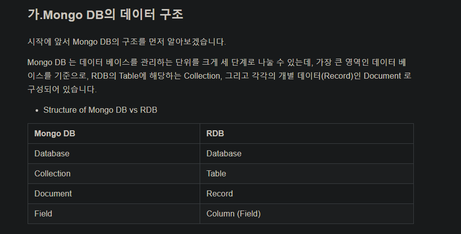

# Express - MongoDB  With TypeScript

---


## npm 시작하기

```bash
npm init
```


## 필요한 모듈 설치하기

```bash
npm i --save express typescript ts-node cors body-parser
```


## JS Type을 TS로 설정함

- `@types/express` : express 라이브러리의 타입을 추가해준다.
- `@types/node` : node.js 타입을 추가해준다.

```bash
npm i @types/node @types/express nodemon
```


## mongoDB 설치하기

> - **Promise에관한 설명**
>
> **[https://medium.com/@pks2974/javascript-%EC%99%80-promise-a6db8ca424ed](https://medium.com/@pks2974/javascript-와-promise-a6db8ca424ed)**
>
> - **async / await에 관한 설명**
>
> https://joshua1988.github.io/web-development/javascript/js-async-await/ 
>
> - **MONGO DB 구조**
>
> 

### 1. 우선 다운받는다

```BASH
npm i mongodb
npm i @types/mongodb  --mongodb를 넘겨주기위한타입이다
```

### 2. `tsconfig.json` 파일을 생성하고 아래 내용을 넣어줌

```json
{
    "compilerOptions": {
        "target": "esnext"
    }
}
```


## mongoose 활용하기


### 1. 설치함

```bash
npm i mongoose
npm i @types/mongoose
```

